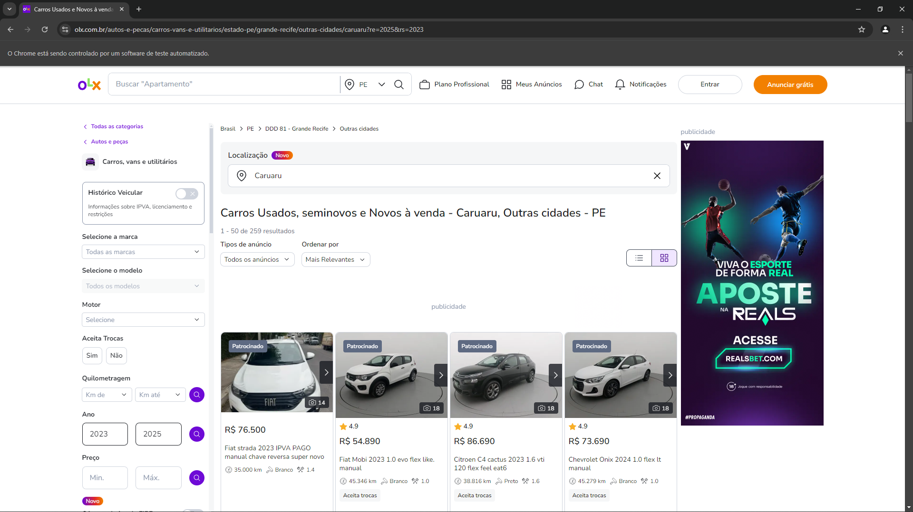
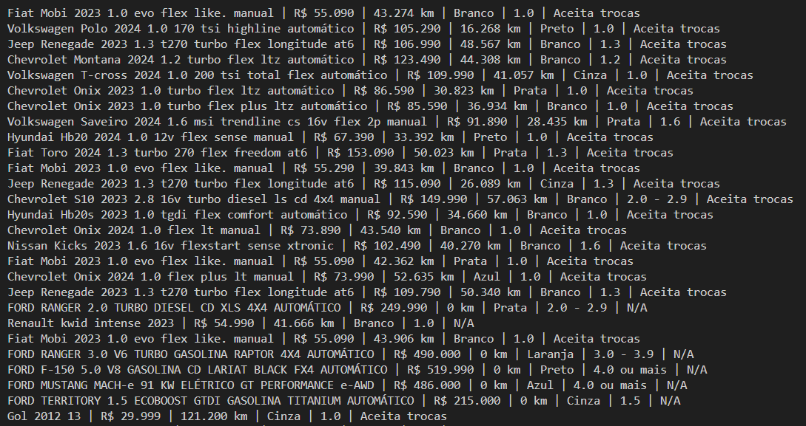

# Web Scraper de Carros - OLX

Este projeto é um **web scraper** desenvolvido em Python que coleta informações de carros anunciados no site da OLX. Ele utiliza a biblioteca `selenium` para navegar no site, extrair os dados e salvá-los em uma planilha Excel para análise e organização.

## Funcionalidades

- **Extração de dados**: O scraper coleta informações como nome do carro, preço, quilometragem, cor, cilindradas e se aceita troca.
- **Navegação automatizada**: O script percorre as páginas de resultados automaticamente.
- **Geração de planilha**: Os dados coletados são armazenados em uma planilha Excel (`sheet_price_cars.xlsx`), com títulos formatados em **negrito** e colunas ajustadas ao tamanho dos dados.

## Requisitos

Antes de executar o projeto, certifique-se de ter instalado os seguintes itens:

- Python 3.8+
- Google Chrome
- [ChromeDriver](https://chromedriver.chromium.org/)
- Bibliotecas Python:
  - `selenium`
  - `openpyxl`

Você pode instalar as dependências com o comando:

```bash
pip install -r requirements.txt
```

## Estrutura do Projeto

```plaintext
├── main.py                   # Código principal do scraper
├── requirements.txt          # Dependências do projeto
├── README.md                 # Documentação do projeto
├── sheet_price_cars.xlsx     # Planilha gerada com os dados
└── images                    # Pasta com imagens para o README
    ├── chrome_running.png
    ├── planilha_excel.png
    └── cmd_execution.png
```

## Uso

1. **Clone o Repositório**:

   ```bash
   git clone https://github.com/seu-usuario/web-scraper-carros.git
   cd web-scraper-carros
   ```

2. **Configure o ChromeDriver**:

   Certifique-se de que o ChromeDriver está instalado e no PATH do sistema. A versão do ChromeDriver deve ser compatível com a versão do Google Chrome instalada.

3. **Execute o Script**:

   Inicie o scraper com o comando:

   ```bash
   python main.py
   ```

4. **Confira os Resultados**:

   Após a execução, os dados estarão disponíveis no arquivo `sheet_price_cars.xlsx`.

## Personalização

Caso queira mudar o link de busca no site da OLX, altere a variável `self.link` no início do script para o URL desejado:

```python
self.link = "https://www.olx.com.br/autos-e-pecas/carros-vans-e-utilitarios/estado-pe/grande-recife/outras-cidades/caruaru?re=2025&rs=2023"
```

## Considerações Importantes

- **Taxa de Requisições**: Este script foi configurado para funcionar com intervalos entre as interações (`sleep()`) para evitar sobrecarregar o servidor da OLX. Use-o de forma responsável.
- **Erros de SSL**: Se mensagens de erro relacionadas a SSL aparecerem no console, elas não afetam o funcionamento do scraper e podem ser ignoradas.

## Melhorias Futuras

- Implementar suporte a múltiplos sites de busca.
- Adicionar um sistema de logs para rastrear o progresso e eventuais erros.
- Incluir uma interface gráfica para facilitar o uso do scraper.

## Demonstração

### Navegador em Funcionamento
O script abre o navegador automaticamente e começa a coletar dados:


### Planilha Gerada
Após a execução, os dados coletados são organizados em uma planilha Excel:


### Execução no CMD
O processo é iniciado no terminal, conforme mostrado abaixo:


## Contribuição

Sinta-se à vontade para abrir issues ou enviar pull requests com sugestões e melhorias.

## Licença

Este projeto está licenciado sob a Licença MIT. Consulte o arquivo `LICENSE` para mais informações.

---

**Autor**: Leonardo Almeida
**Contato**: [leonardoalmd8@gmail.com](mailto:leonardoalmd8@gmail.com)
```

Você pode ajustar o conteúdo, como o link do repositório ou informações de contato, conforme necessário. 🚀